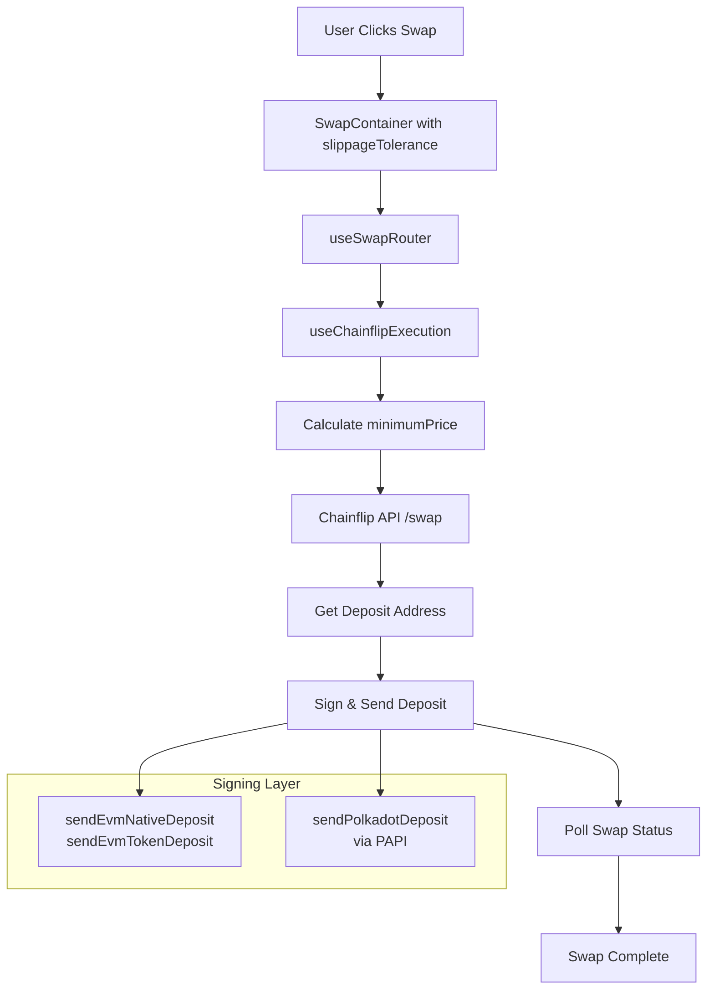

<!-- e259d731-eb4d-446a-ba15-6a5fa41d7e54 5450f5f6-ad16-4343-95af-1ab894ccc487 -->
# Chainflip Swap API Fixes & Automated Signing

## Problem Statement

The Chainflip swap API currently fails with 400 errors because required parameters (`minimumPrice`, `refundAddress`, `retryDurationBlocks`) are missing. Additionally, after receiving a deposit address, the user must manually send funds, breaking the seamless swap experience. We need to automate the deposit transaction using wallet signers.

## Architecture Overview



## Implementation Steps

### Phase 1: Fix API Parameters & Types

**File: [`apps/web/src/services/chainflip/types.ts`](apps/web/src/services/chainflip/types.ts)**

Update `ChainflipSwapRequest` interface to make slippage protection parameters required:

```typescript
export interface ChainflipSwapRequest {
  sourceAsset: ChainflipAssetId;
  destinationAsset: ChainflipAssetId;
  destinationAddress: string;
  
  // Required slippage protection parameters
  minimumPrice: string;
  refundAddress: string;
  retryDurationBlocks: number;
  
  // Optional parameters
  boostFee?: number;  // Note: API uses 'boostFee' not 'maxBoostFeeBps'
}
```

Remove the `amount` field from the request type (it's not part of the `/swap` endpoint according to the API docs).

---

### Phase 2: Add Helper Functions

**File: [`apps/web/src/services/chainflip/client.ts`](apps/web/src/services/chainflip/client.ts)**

Add helper functions for slippage calculations:

```typescript
/**
 * Calculate minimum price with slippage tolerance
 * Formula: minimumPrice = estimatedPrice * (1 - slippagePercent / 100)
 */
export const calculateMinimumPrice = (
  estimatedPrice: string | number, 
  slippagePercent: number
): string => {
  const price = typeof estimatedPrice === 'string' 
    ? parseFloat(estimatedPrice) 
    : estimatedPrice;
  const multiplier = (100 - slippagePercent) / 100;
  const minimumPrice = price * multiplier;
  return minimumPrice.toFixed(10); // High precision for price ratios
};

/**
 * Convert minutes to blocks (1 block = 6 seconds on Chainflip)
 */
export const minutesToBlocks = (minutes: number): number => {
  return Math.floor((minutes * 60) / 6);
};
```

Update the `requestSwapDepositAddress` method to send correct parameters:

```typescript
async requestSwapDepositAddress(request: ChainflipSwapRequest): Promise<ChainflipSwapResponse> {
  const body: Record<string, unknown> = {
    sourceAsset: request.sourceAsset,
    destinationAsset: request.destinationAsset,
    destinationAddress: request.destinationAddress,
    minimumPrice: request.minimumPrice,
    refundAddress: request.refundAddress,
    retryDurationBlocks: request.retryDurationBlocks,
  };

  if (request.boostFee !== undefined) {
    body.boostFee = request.boostFee;
  }

  return await this.post<ChainflipSwapResponse>('/swap', body);
}
```

---

### Phase 3: Add Polkadot Signing Support

**File: [`apps/web/src/services/chainflip/signerUtils.ts`](apps/web/src/services/chainflip/signerUtils.ts)**

Add Polkadot deposit function using PAPI:

```typescript
/**
 * Send DOT or AssetHub token deposit to Chainflip
 * Uses Polkadot API (PAPI) for transaction building
 */
export async function sendPolkadotDeposit(
  polkadotSigner: any,
  depositAddress: string,
  amount: string,
  decimals: number,
  assetId?: string  // For tokens like USDC (asset ID 1337), undefined for DOT
): Promise<DepositResult> {
  try {
    // Import PAPI dynamically
    const { createClient } = await import('polkadot-api');
    const { getWsProvider } = await import('polkadot-api/ws-provider/web');
    
    // Connect to AssetHub
    const client = createClient(
      getWsProvider('wss://polkadot-asset-hub-rpc.polkadot.io')
    );
    
    // Build transfer transaction
    const amountBigInt = BigInt(toSmallestUnit(amount, decimals));
    
    let tx;
    if (assetId) {
      // Transfer asset (USDC, USDT, etc.)
      tx = client.tx.Assets.transfer({
        id: assetId,
        target: depositAddress,
        amount: amountBigInt,
      });
    } else {
      // Transfer native DOT
      tx = client.tx.Balances.transfer_keep_alive({
        dest: depositAddress,
        value: amountBigInt,
      });
    }
    
    // Sign and submit
    const txHash = await tx.signAndSubmit(polkadotSigner);
    
    return {
      txHash,
      success: true,
    };
  } catch (error) {
    console.error('❌ Polkadot deposit failed:', error);
    return {
      txHash: '',
      success: false,
      error: error instanceof Error ? error.message : 'Unknown error',
    };
  }
}
```

Update `getDepositType` function to include AssetHub:

```typescript
export function getDepositType(
  network: string,
  symbol: string
): 'evm-native' | 'evm-token' | 'polkadot-native' | 'polkadot-token' | 'unsupported' {
  switch (network) {
    case 'Ethereum':
    case 'Arbitrum':
      return symbol === 'ETH' ? 'evm-native' : 'evm-token';
    case 'AssetHubPolkadot':
      return symbol === 'DOT' ? 'polkadot-native' : 'polkadot-token';
    case 'Solana':
    case 'Bitcoin':
      return 'unsupported'; // Not yet implemented
    default:
      return 'unsupported';
  }
}
```

---

### Phase 4: Update Execution Hook

**File: [`apps/web/src/components/swap/hooks/useChainflipExecution.ts`](apps/web/src/components/swap/hooks/useChainflipExecution.ts)**

1. **Add imports:**
```typescript
import {
  chainflipClient,
  calculateMinimumPrice,
  minutesToBlocks,
  // ... other imports
} from '@/services/chainflip';
import {
  sendEvmNativeDeposit,
  sendEvmTokenDeposit,
  sendPolkadotDeposit,
  getDepositType,
} from '@/services/chainflip/signerUtils';
```

2. **Add parameters to props interface:**
```typescript
interface UseChainflipExecutionProps {
  // ... existing props
  slippageTolerance: number;
  evmSigner?: any;
  polkadotSigner?: any;
}
```

3. **Implement automatic deposit in `executeSwap`:**
```typescript
// Calculate slippage protection
const retryMinutes = 15;
let minimumPrice = '0';

if (quote?.egressAmount && quote?.ingressAmount) {
  const estimatedPrice = parseFloat(quote.egressAmount) / parseFloat(quote.ingressAmount);
  minimumPrice = calculateMinimumPrice(estimatedPrice, slippageTolerance);
}

// Request deposit address with slippage protection
const swapResponse = await chainflipClient.requestSwapDepositAddress({
  sourceAsset: inputToken.chainflipId,
  destinationAsset: outputToken.chainflipId,
  destinationAddress: recipientAddress,
  minimumPrice,
  refundAddress: walletAddress,
  retryDurationBlocks: minutesToBlocks(retryMinutes),
});

// Automatically send deposit transaction
updateStage('submitting');

const depositType = getDepositType(
  inputToken.network || '', 
  inputToken.symbol
);

let depositResult;
switch (depositType) {
  case 'evm-native':
    depositResult = await sendEvmNativeDeposit(
      evmSigner,
      swapResponse.depositAddress,
      inputAmount,
      inputToken.decimals || 18
    );
    break;
    
  case 'evm-token':
    depositResult = await sendEvmTokenDeposit(
      evmSigner,
      swapResponse.depositAddress,
      inputToken.contractAddress!,
      inputAmount,
      inputToken.decimals || 6
    );
    break;
    
  case 'polkadot-native':
  case 'polkadot-token':
    const assetId = depositType === 'polkadot-token' 
      ? inputToken.assetId  // e.g., "1337" for USDC
      : undefined;
    depositResult = await sendPolkadotDeposit(
      polkadotSigner,
      swapResponse.depositAddress,
      inputAmount,
      inputToken.decimals || 10,
      assetId
    );
    break;
    
  default:
    throw new Error('Unsupported chain for automated deposits');
}

if (!depositResult.success) {
  throw new Error(depositResult.error);
}

// Continue with status polling
updateStage('confirming', { txHash: depositResult.txHash });
pollSwapStatus(swapResponse.id);
```

4. **Add new parameters to dependency array:**
```typescript
}, [
  // ... existing deps
  slippageTolerance,
  evmSigner,
  polkadotSigner,
  quote,
]);
```


---

### Phase 5: Wire Up from SwapContainer

**File: [`apps/web/src/components/swap/SwapContainer.tsx`](apps/web/src/components/swap/SwapContainer.tsx)**

Pass additional parameters to `useChainflipExecution`:

```typescript
const { 
  executeSwap: executeChainflipSwap,
  depositAddress: chainflipDepositAddress,
  stage: chainflipStage,
} = useChainflipExecution({
  inputToken: provider === 'chainflip' ? inputToken : null,
  outputToken: provider === 'chainflip' ? outputToken : null,
  inputAmount,
  outputAmount,
  quote: chainflipQuote || null,
  walletAddress,
  recipientAddress,
  slippageTolerance,           // Add this
  evmSigner,                   // Add this (already available)
  polkadotSigner: senderPolkadotSigner,  // Add this
  // ... callbacks
});
```

---

### Phase 6: Update Asset Registry

**File: [`apps/web/src/services/xcm-router/assetRegistry.ts`](apps/web/src/services/xcm-router/assetRegistry.ts)**

Ensure AssetHub tokens have the `assetId` field for token identification:

```typescript
"USDC-1337-AssetHubPolkadot": {
  network: "AssetHubPolkadot",
  assetType: "Asset ID",
  displayName: "USDC (AssetHub)",
  verified: true,
  provider: 'xcm',
  chainflipId: 'usdc.hub',
  decimals: 6,
  assetId: "1337",  // Add this for Assets.transfer call
},
```

Do the same for USDT on AssetHub if configured.

---

### Phase 7: Update TokenInfo Type

**File: [`apps/web/src/components/swap/types.ts`](apps/web/src/components/swap/types.ts)**

Add `assetId` field to `TokenInfo`:

```typescript
export interface TokenInfo {
  // ... existing fields
  chainflipId?: string;
  contractAddress?: string;
  assetId?: string;  // Add this for Polkadot asset identification
}
```

Update token conversion in [`useXcmTokens.ts`](apps/web/src/components/swap/hooks/useXcmTokens.ts) to pass through `assetId`.

---

## Testing Strategy

1. **EVM Native (ETH)**

            - Test: ETH (Ethereum) → USDC (Arbitrum)
            - URL: `http://localhost:3000/?from=ETH&fromNetwork=Ethereum&to=USDC&toNetwork=Arbitrum`
            - Verify: Single MetaMask signature, automatic deposit

2. **EVM Token (USDC)**

            - Test: USDC (Ethereum) → SOL (Solana)
            - URL: `http://localhost:3000/?from=USDC&fromNetwork=Ethereum&to=SOL&toNetwork=Solana`
            - Verify: ERC20 transfer signature, automatic deposit

3. **Polkadot Native (DOT)**

            - Test: DOT (AssetHub) → USDC (Arbitrum)
            - URL: `http://localhost:3000/?from=DOT&fromNetwork=AssetHubPolkadot&to=USDC&toNetwork=Arbitrum`
            - Verify: Polkadot.js signature, automatic deposit

4. **Polkadot Token (USDC)**

            - Test: USDC (AssetHub) → ETH (Ethereum)
            - URL: `http://localhost:3000/?from=USDC&fromNetwork=AssetHubPolkadot&to=ETH&toNetwork=Ethereum`
            - Verify: Asset transfer signature, automatic deposit

5. **Slippage Protection**

            - Test: Set slippage to 0.5% in UI
            - Verify: `minimumPrice` calculated correctly in API call
            - Verify: Refund occurs if price moves beyond tolerance

---

## Error Handling

- **Missing signer**: Clear error message "Please connect [chain] wallet"
- **User cancellation**: Detect "User rejected" in error message, mark as cancelled
- **Insufficient balance**: EVM/Polkadot will reject before signing
- **Slippage exceeded**: Chainflip will refund to `refundAddress`, show in UI
- **Deposit timeout**: Stop polling after 30 minutes, show manual check link

---

## Migration Notes

- Existing XCM swaps remain unchanged
- Chainflip swaps now require single signature (vs. manual deposit)
- Slippage tolerance from UI applies to both XCM and Chainflip routes
- Bitcoin and Solana swaps remain unsupported (show "coming soon" message)

### To-dos

- [ ] Update ChainflipSwapRequest interface with required slippage parameters
- [ ] Add calculateMinimumPrice and minutesToBlocks helper functions
- [ ] Fix requestSwapDepositAddress to send correct API parameters
- [ ] Implement sendPolkadotDeposit function using PAPI
- [ ] Add automatic deposit signing to useChainflipExecution
- [ ] Pass slippageTolerance and signers from SwapContainer
- [ ] Add assetId field to AssetHub tokens in registry
- [ ] Test EVM and Polkadot swap flows with different token pairs