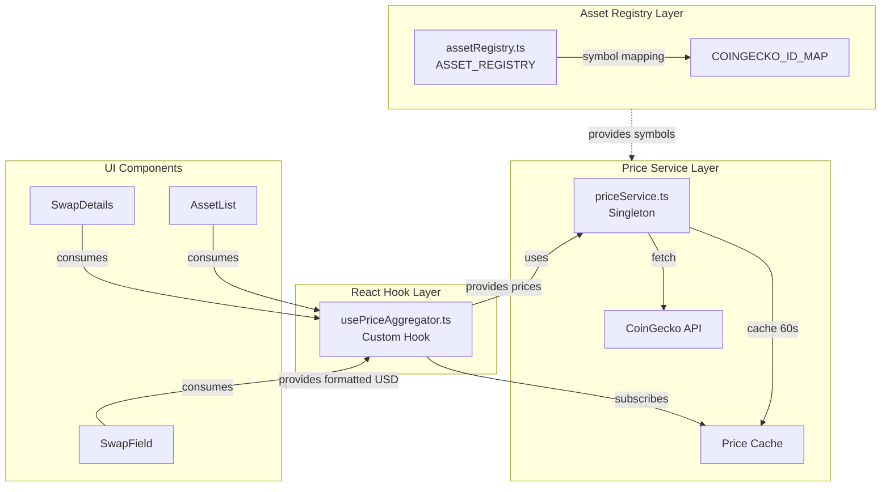
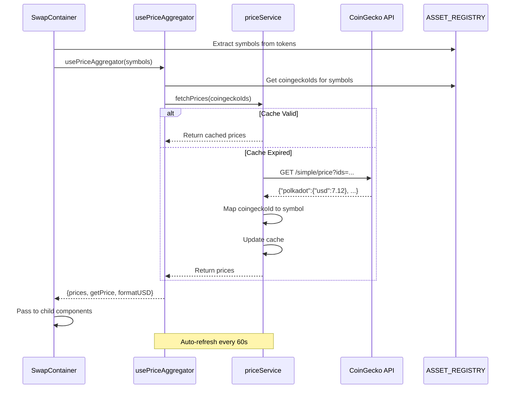

# CoinGecko Price Integration Plan

## Architecture Overview



## Phase 1: Extend Asset Registry

**File**: [apps/web/src/services/xcm-router/assetRegistry.ts](apps/web/src/services/xcm-router/assetRegistry.ts)

Add CoinGecko ID mapping at the top-level of each `AssetRegistryEntry`:

```typescript
export type AssetRegistryEntry = {
  symbol: string;
  name: string;
  description?: string;
  category: "stablecoin" | "native" | "defi" | "wrapped";
  logo?: string;
  coingeckoId?: string;  // NEW: CoinGecko API ID for price lookup
  dexConfig?: {
    preferredExchange?: TExchangeChain;
  };
  networkInstances: Record<string, { ... }>;
};
```

Update each asset entry in `ASSET_REGISTRY`:

```typescript
"USDC": {
  symbol: "USDC",
  name: "USD Coin",
  coingeckoId: "usd-coin",  // NEW
  category: "stablecoin",
  networkInstances: { ... }
},
"DOT": {
  symbol: "DOT",
  name: "Polkadot",
  coingeckoId: "polkadot",  // NEW
  category: "native",
  networkInstances: { ... }
},
```

Add all mappings for: DOT, USDC, USDT, ETH, SOL, BTC, FLIP, ACA, GLMR

## Phase 2: Create Price Service

**New File**: [apps/web/src/services/prices/coingeckoService.ts](apps/web/src/services/prices/coingeckoService.ts)

```typescript
interface PriceCache {
  prices: Record<string, number>;  // symbol -> USD price
  lastUpdated: number;
  ttl: number;
}

class CoinGeckoPriceService {
  private cache: PriceCache;
  private readonly API_BASE = 'https://api.coingecko.com/api/v3';
  private readonly CACHE_TTL = 60000; // 1 minute
  
  async fetchPrices(coingeckoIds: string[]): Promise<Record<string, number>>;
  getPrice(symbol: string): number | null;
  formatUSD(amount: string, symbol: string, decimals: number): string;
  clearCache(): void;
}

export const priceService = new CoinGeckoPriceService();
```

Key features:

- Batch fetching via `/simple/price?ids=polkadot,ethereum,usd-coin&vs_currencies=usd`
- 60-second cache to stay under rate limits (10-50 calls/min free tier)
- Map CoinGecko IDs back to asset symbols
- Graceful error handling (returns null if unavailable)

**New File**: [apps/web/src/services/prices/index.ts](apps/web/src/services/prices/index.ts)

Export barrel file for clean imports.

## Phase 3: Create React Hook

**New File**: [apps/web/src/services/prices/usePriceAggregator.ts](apps/web/src/services/prices/usePriceAggregator.ts)

```typescript
export function usePriceAggregator(symbols?: string[]) {
  const [prices, setPrices] = useState<Record<string, number>>({});
  const [isLoading, setIsLoading] = useState(true);
  const [error, setError] = useState<string | null>(null);

  // Fetch prices on mount and refresh every 60s
  useEffect(() => {
    const fetchAndCache = async () => {
      // Get coingeckoIds from ASSET_REGISTRY
      const coingeckoIds = symbols
        .map(s => ASSET_REGISTRY[s]?.coingeckoId)
        .filter(Boolean);
      
      const priceData = await priceService.fetchPrices(coingeckoIds);
      setPrices(priceData);
    };
    
    fetchAndCache();
    const interval = setInterval(fetchAndCache, 60000);
    return () => clearInterval(interval);
  }, [symbols]);

  return {
    prices,
    isLoading,
    error,
    getPrice: (symbol: string) => prices[symbol] || null,
    formatUSD: (amount: string, symbol: string, decimals: number) => 
      priceService.formatUSD(amount, symbol, decimals),
  };
}
```

## Phase 4: Update Type Definitions

**File**: [apps/web/src/components/swap/types.ts](apps/web/src/components/swap/types.ts)

Add optional USD price fields:

```typescript
export interface TokenInfo {
  // ... existing fields ...
  usdPrice?: number;  // NEW: Current USD price per token
}

export interface SwapFieldProps {
  // ... existing fields ...
  showUsdValue?: boolean;  // NEW: Toggle USD display
}
```

## Phase 5: Integrate into UI Components

### 5.1 SwapContainer (Root)

**File**: [apps/web/src/components/swap/SwapContainer.tsx](apps/web/src/components/swap/SwapContainer.tsx)

Add hook at container level to fetch prices for all visible tokens:

```typescript
// Extract unique symbols from fromTokens and toTokens
const allSymbols = useMemo(() => {
  const symbols = new Set<string>();
  fromTokens.forEach(t => symbols.add(t.symbol));
  toTokens.forEach(t => symbols.add(t.symbol));
  return Array.from(symbols);
}, [fromTokens, toTokens]);

// Fetch prices for all symbols
const { prices, getPrice, formatUSD } = usePriceAggregator(allSymbols);
```

Pass down to child components via props.

### 5.2 SwapField Component

**File**: [apps/web/src/components/swap/ui/SwapField.tsx](apps/web/src/components/swap/ui/SwapField.tsx)

Display USD value below the token amount input (line ~210):

```tsx
<Input
  type="text"
  value={amount}
  onChange={handleInputChange}
  // ... existing props
/>
{/* NEW: USD Value Display */}
{token && amount && parseFloat(amount) > 0 && (
  <div className="text-sm text-forest-400 mt-1 text-right">
    ≈ {formatUSD(amount, token.symbol, token.decimals)}
  </div>
)}
```

### 5.3 AssetList Component

**File**: [apps/web/src/components/swap/ui/AssetList.tsx](apps/web/src/components/swap/ui/AssetList.tsx)

Replace hardcoded `$0` (line 58) with actual price:

```tsx
<span className="text-forest-400 text-sm">
  {getPrice(group.symbol) 
    ? `$${getPrice(group.symbol)?.toFixed(2)}` 
    : '—'}
</span>
```

### 5.4 SwapDetails Component

**File**: [apps/web/src/components/swap/ui/SwapDetails.tsx](apps/web/src/components/swap/ui/SwapDetails.tsx)

Add USD value for "Minimum Received" (line ~65):

```tsx
<SubText className="justify-self-end">
  {isLoadingQuote ? (
    <Skeleton className="w-20 h-5 animate-pulse" />
  ) : (
    <>
      {displayValue(minimumReceived, outputToken?.symbol || '')}
      {outputToken && minimumReceived && (
        <div className="text-xs text-forest-400">
          ≈ {formatUSD(minimumReceived, outputToken.symbol, outputToken.decimals)}
        </div>
      )}
    </>
  )}
</SubText>
```

## Data Flow



## Environment Variables (Optional)

**File**: [apps/web/.env.local](apps/web/.env.local) (if using Pro API key)

```bash
# Optional: CoinGecko Pro API key for higher rate limits
NEXT_PUBLIC_COINGECKO_API_KEY=
```

## UI Display Locations

1. **SwapField** (input/output amounts) - Below token amount, small gray text
2. **AssetList** (token selection dialog) - Right side of each asset group
3. **SwapDetails** (minimum received) - Below minimum received amount
4. **Future**: SwapPreview modal (total swap value comparison)

## Error Handling

- Show "—" or omit USD value if price unavailable
- Log errors to console without blocking UI
- Graceful degradation: app works without prices
- Retry failed fetches on next interval (60s)

## Testing Strategy

1. Mock CoinGecko API responses in tests
2. Test cache expiration logic
3. Test symbol to coingeckoId mapping
4. Test UI components with/without price data
5. Test rate limit handling (429 responses)

## Benefits of This Approach

- **No duplication**: Single source of truth in `ASSET_REGISTRY`
- **Minimal bundle size**: Only one price service, shared across all components
- **Efficient API usage**: Batch fetching + caching respects rate limits
- **Scalable**: Easy to add new assets (just add `coingeckoId` field)
- **Type-safe**: Leverages existing TypeScript types
- **Graceful**: UI works