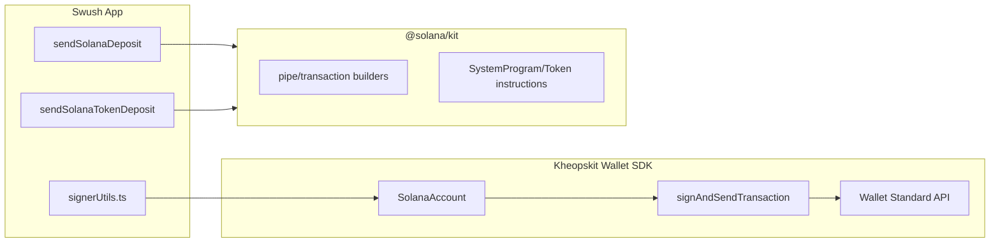

# Add Solana Transaction Signing for Chainflip Deposits

## Why @solana/kit over @solana/web3.js

- **Modular & tree-shakeable**: Much smaller bundle size (critical for web apps)
- **Functional API**: Aligns with kheopskit's functional patterns and existing codebase style
- **First-class TypeScript**: Better type safety and DX
- **Native Wallet Standard**: Direct integration with what you're already using
- **Modern maintenance**: Active development, future of Solana JS ecosystem

## Architecture




## Implementation Steps

### Part 1: Extend kheopskit (wallet SDK)

**1.1 Update SolanaAccount type** in [packages/core/src/api/types.ts](kheopskit-wallet-sdk/packages/core/src/api/types.ts)Add `signAndSendTransaction` method:

```typescript
export type SolanaAccount = {
  id: WalletAccountId;
  platform: "solana";
  publicKey: Uint8Array;
  address: string;
  walletName: string;
  walletId: string;
  signMessage: (message: Uint8Array) => Promise<Uint8Array>;
  signAndSendTransaction: (
    transaction: Uint8Array,
    options?: { minContextSlot?: number }
  ) => Promise<{ signature: Uint8Array }>;
};
```

**1.2 Wire up signAndSendTransaction** in [packages/core/src/api/solana/accounts.ts](kheopskit-wallet-sdk/packages/core/src/api/solana/accounts.ts)Add the transaction signing function in `mapAccount()` using the `solana:signAndSendTransaction` feature from Wallet Standard (similar pattern to existing `signMessage`).

### Part 2: Implement Solana deposits in swush-app

**2.1 Install dependencies** in swush-app:

```bash
pnpm add @solana/kit @solana/signers @solana/transaction-messages @solana/transactions @solana/addresses @solana/codecs -F web
```

**2.2 Update signerUtils.ts** in [apps/web/src/services/chainflip/signerUtils.ts](swush-app/apps/web/src/services/chainflip/signerUtils.ts)

- Update `SolanaAccount` interface to match kheopskit's type
- Implement `sendSolanaDeposit()` for native SOL transfers using @solana/kit's functional API
- Implement `sendSolanaTokenDeposit()` for SPL token transfers
- Update `isChainSupportedForDeposit()` to include Solana

**2.3 Key @solana/kit patterns to use:**

```typescript
// Transaction building with @solana/kit
import { pipe } from '@solana/functional';
import { createTransactionMessage, setTransactionMessageFeePayer } from '@solana/transaction-messages';
import { getTransferSolInstruction } from '@solana/system-program';
import { compileTransaction } from '@solana/transactions';
```


## Notes