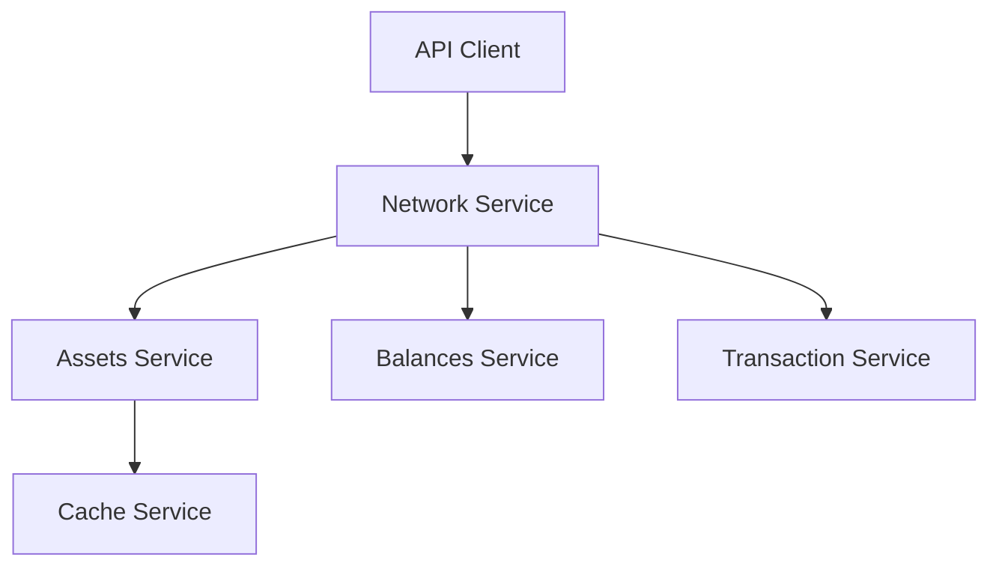

# Backend Services Overview

## Services Architecture

The API services are organized into specialized modules under `packages/api/services/`:

### Assets Service (`/services/assets/`)
Handles all asset-related operations across different chains:
- Asset discovery and metadata retrieval
- Price feed integration

### Balances Service (`/services/balances/`)
Manages balance-related operations:
- Account balance tracking

### Network Service (`/services/network/`)
Handles chain connectivity and network operations:
- Chain connection management
- Network status monitoring
- Chain metadata synchronization
- Health checks

More info on network service can be found in the [Network Service docs](./NETWORK_RPC.md) documentation.

### Transaction Service (`/services/txn/`)
Manages transaction-related operations:
- Transaction construction
- Transaction status monitoring

Note: this will be completely implemented in Milestone 2.

### Cache Service (`/services/cache/`)
Implements caching strategies:
- Asset metadata caching for fast retrieval
- Periodic refresh of cached data

Key Features:
- In-memory caching
- Cache refresh callbacks

## Service Integration Flow

