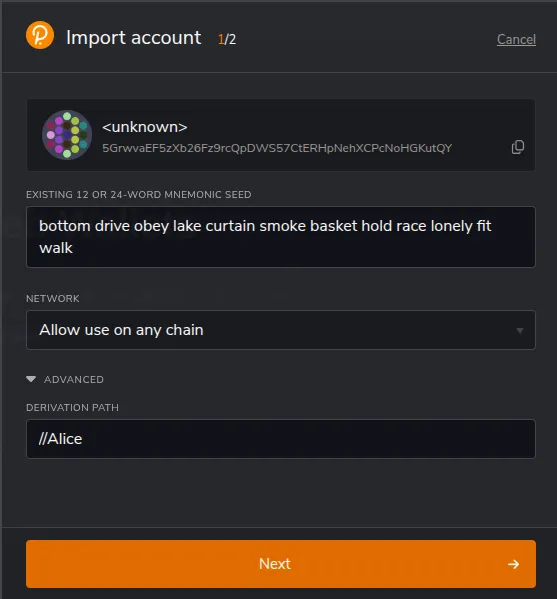

Steps to setup test wallet for Alice (Dev):

1. Mnemonic Phrase:
bottom drive obey lake curtain smoke basket hold race lonely fit walk
2. Derivation Path:
//Alice
3. Address:
15oF4uVJwmo4TdGW7VfQxNLavjCXviqxT9S1MgbjMNHr6Sp5

To import into Polkadot.js extension or other web wallets:

1. Click on 'Import Account from pre-existing seed'
2. Enter the mnemonic phrase
3. In advanced options, **enter the derivation path** "//Alice"

Refer image below :

